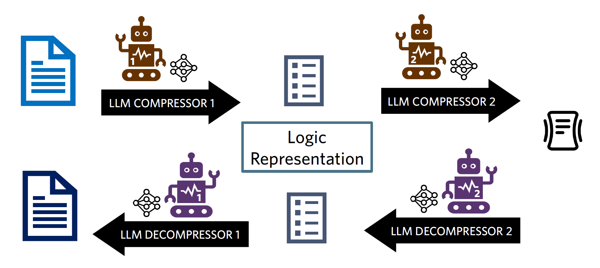

# Semantic Compression: Streamlining Text Transmission with Large Language Models

In this project, we explore the wide applications of lossy text compression directly utilizing Large Language Models (LLMs).

<div style="display:flex;">
    <div style="width:100%;float:left">
        Authors: Luning Yang, Yacun Wang
    </div>
</div>

### Model

While the baseline model directly prompts an LLM to perform compression and decompression, the multi-stage compression pipeline introduces an intermediate logic representation:

<p align="center"></p>


### Environment

We run all of our experiments in Python `3.9.19`. To setup a specific conda environment, first create:

```sh
conda create -n llm-semantic-compression python=3.9.19
```

Activate the environment:

```sh
conda activate llm-semantic-compression
```

Install the required packages:

```sh
pip install -r requirements.txt
```

### Data

The datasets used in the experiments are: `nyt` (news article, coarse and fine-grained topic labels), `yelp` (restaurant reviews, labels on cuisine). Each dataset must have a `df.pkl` placed in `data/`. The file should be a compressed Pandas DataFrame using `pickle` containing two columns: `sentence` (for documents) and `label` (for the corresponding label, if evaluating on classification accuracy). When running code, any produced files will also be stored in `data/`.

### Commands

To run the experiments, refer to the full command:

```
python run.py [-h] [-d DATA] [-m {baseline,multi-stage}] [-s SAMPLES] [-r RANDOM_SEED]

arguments:
  -h, --help            show this help message and exit
  -d DATA, --data DATA  dataset name
  -m {baseline,multi-stage}, --model {baseline,multi-stage}
                        compression pipeline to run
  -s SAMPLES, --samples SAMPLES
                        The number of documents to randomly sample from data.
  -r RANDOM_SEED, --random_seed RANDOM_SEED
                        Random seed for reproducibility
```

***Note***: The script will prompt the user to enter the OpenAI API Key (for both models) and text genre (if using the multi-stage pipeline). Please make sure you have a valid OpenAI API Key to run `gpt-4o-mini` inference.